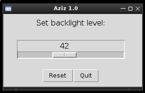

# Aziz.py
A simple [tkinter](https://docs.python.org/3/library/tk.html) [GUI](https://en.wikipedia.org/wiki/Graphical_user_interface) for [xbacklight](https://linux.die.net/man/1/xbacklight) command

---

The name Aziz makes reference to [The Fift Element](http://www.imdb.com/title/tt0119116/) character.

The program main interface uses a ["scale"](http://effbot.org/tkinterbook/scale.htm) tkinter widget to adjust backlight brightness.

---

## More info:
* [Tkinter:](https://en.wikipedia.org/wiki/Tkinter)
* [xbacklight](https://www.x.org/archive/X11R7.5/doc/man/man1/xbacklight.1.html)
* [The Fifht Element (1997)](http://www.imdb.com/title/tt0119116/)

---

The program is delivered "Aziz" (pun intended), with _no warranty at all_.

